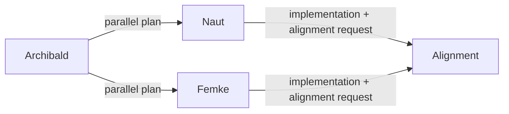

# Parallel Delegation Plan: WI-005 — Separate PoC File Upload Endpoint

## Architecture Constraints

- [D-001] PoC filenames are matched case-insensitively with PDF extension stripped. The `store()` method must preserve the original filename for retrieval by `hasMatchingPoC()`.
- [D-003] The PoC store path is configurable via `application.yml`. The `store()` implementation must use the same configurable path as `hasMatchingPoC()`.
- [D-015] Non-PDF files must be rejected with 400 Bad Request. The controller must validate MIME type before calling the store.
- [D-016] Duplicate filenames overwrite existing files. The `store()` method must not throw an exception on duplicate.
- [D-017] The endpoint is `POST /api/v1/poc-upload` using `multipart/form-data` with a `file` field.
- [D-017] The invoice number is derived from the filename, not from a request body field.

## Shared Contract

`docs/api-contract-wi-005.md` (version 5.0.0)

Both agents consume this identical contract file. All endpoints, request shapes, and response schemas are final and must not be modified.

## Subtasks

### Subtask 1: Backend Implementation
- **Assigned Agent**: Naut (Backend Agent)
- **Input Artefact**: `docs/api-contract-wi-005.md`, `5-backend/business-service/src/main/java/com/gimmevettingsolution/poc/PoCStoreService.java`, `5-backend/business-service/src/main/java/com/gimmevettingsolution/poc/FileBackedPoCStoreService.java`
- **Output Artefact**: Java backend source code in `5-backend/`, unit tests, integration tests
- **Constraints**: 
  - Add `void store(MultipartFile file)` method to the `PoCStoreService` interface.
  - Implement `store()` in `FileBackedPoCStoreService` using the same configurable path, path traversal protection (`SAFE_PATTERN`), and case-insensitive filename handling as `hasMatchingPoC()`.
  - Create `PoCUploadController` class with `POST /api/v1/poc-upload` endpoint.
  - Validate MIME type (`application/pdf`) before calling `store()`. Reject non-PDF with 400 response matching the contract error schema.
  - Catch `SecurityException` from filename validation and return 400 with `errorDetail: "Path traversal detected..."`.
  - Wrap all exceptions in 500 response matching the contract error schema.
  - The invoice number in the 200 OK response is the filename without `.pdf` extension, case-normalized.
  - Follow existing code patterns: use Lombok annotations where appropriate, follow the controller structure in `ExcelIntakeController` for consistency.
- **Security Considerations**: Server-side MIME type validation (not just client-sent Content-Type). Filename sanitization against path traversal. No server internals exposed in error responses.

### Subtask 2: Frontend Implementation
- **Assigned Agent**: Femke (Frontend Agent)
- **Input Artefact**: `docs/api-contract-wi-005.md`, `4-frontend/src/frontend/components/ExcelUpload.jsx`
- **Output Artefact**: Frontend code in `4-frontend/src/frontend/components/`
- **Constraints**: 
  - Create a new PoC upload UI component (e.g., `PoCUpload.jsx`).
  - The frontend must display a list of invoice numbers that are missing PoC files (derived from the return Excel data or from a separate API endpoint if available).
  - For each missing PoC, provide an upload button that allows the user to select and upload a PDF file.
  - All fetch calls must target `POST /api/v1/poc-upload` with `multipart/form-data` content type, matching the contract exactly.
  - On success (200), display a success message and update the UI to reflect the uploaded file.
  - On error (400), display the `errorDetail` message from the contract error response.
  - On error (500), display a generic error message.
  - Follow the existing UI patterns established in `ExcelUpload.jsx` for styling and user feedback.
- **Security Considerations**: No file types other than PDF should be selectable by the user (accept attribute). Client-side validation does not replace server-side validation. Error messages must not expose server internals.

## Parallel Phase Completion Criteria

The parallel phase is considered complete when both Naut and Femke have submitted their respective alignment review requests to the Alignment Agent.

## Delegation Flow

